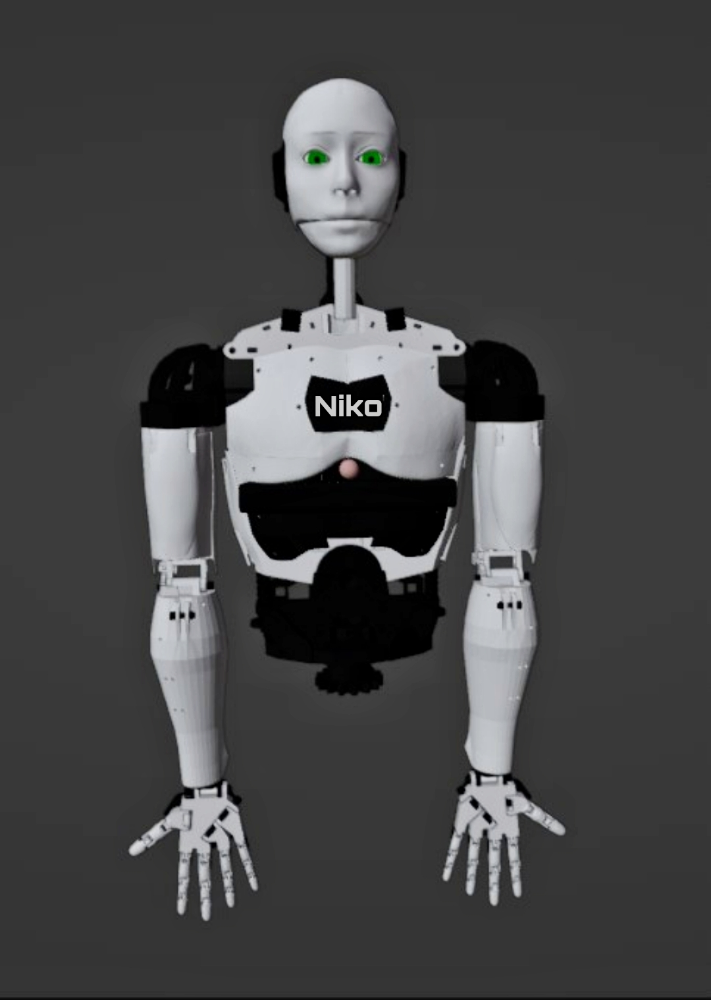
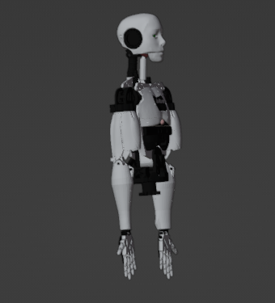
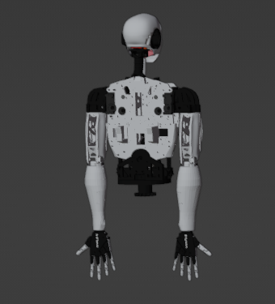

# Robot Vision

 <a href="#Robot Vision">Introduction</a> 
 <a href="#Features">Features</a> 
 <a href="#Device">Component and Device</a> 
 <a href="#languageTools">Language and Tools</a> 
 <a href="#Diagram">Robot Diagram</a> 
 <a href="#memory">Memories</a> 
 <a href="#Acknowledge">Acknowledge</a> 

**Humanoid Robot Using Raspberry PI**

<h2 id="Features">Features</h2> 

- [ ] **Robot Voice**
  - [ ] WakeWord
  - [X] Listening
  - [X] Speaking
  - [X] Custome conversation
  - [ ] Talking in **Bangali** Language 
  
 

- [ ] **Robot System Design**
  - [ ] Robot System Installer Script
  - [ ] Robot Service Installer Script 
  - [ ] Running System in Startup
  - [ ] Gui for Robot interfece
  - [ ] Setup Robot Operating System(ROS)

 

- [ ] **Robot Basic Functions**
  - [ ] Greetings
  - [ ] Searching Information
  - [ ] Capturing Images.
  - [ ] Predicts Time, Date, Weather Report etc. 
  - [ ] Say Jokes :grin:
  - [ ] Tells you latest news feeds.
  - [ ] Send an Email

 

- [ ] **Robot Mobility**
  - [ ] Go forward, backward, left and right using Wheel 
  - [ ] Object Avoiding Mode 
  - [ ] Human Following Mode 
  - [ ] Path planning
  - [ ] Mapping a location 
  
 

- [ ] **Robot Arm Movement**
  - [ ] Handsake 
  - [ ] Salute 
  - [ ] Hand's Up 
  - [ ] Picking Object
  - [ ] Other's arm move 

 

- [ ] **Advanced Machine Learning Features**
  - [ ] Object Detection
  - [ ] Image Detection
  - [ ] Image Recognition 
  - [ ] read Face Emotion
  - [ ] Gender Detection 
  - [ ] Mask Detection 

 

 

<h2 id="Device">Component and Device</h2>

1. **Raspberry Pi** microprocessor
2. **Arduino** microcontroller
3. **Dynamixel**
4. **Lider** 
5. **Raspberry pi Display**
6. **Servo Motors** 
7. **DC Motors** 
8. **Ultrasonic Sensors** 
9. **LCD Display** 
10. **Gas sensor** 
11. **Smoke sensor**
12. **Fire sensor**
13. **Gyroscope sensor**
14. **Gps Tracker** 
15. **LED matrix cube**

 

<h2 id="languageTools">Language and Tools</h2>

| Python | C++ |  Bash | Terminal | Raspberry Pi |  Arduino |
| ------ | ----| ------| -------- | ------------ | --------- |
|||||||

 

<h2 id="Diagram">Robot Diagram</h2>

<h2 id="Acknowledge"> Acknowledge</h2>

 * [StackOverflow](https://stackoverflow.com/questions/tagged/raspberry-pi)